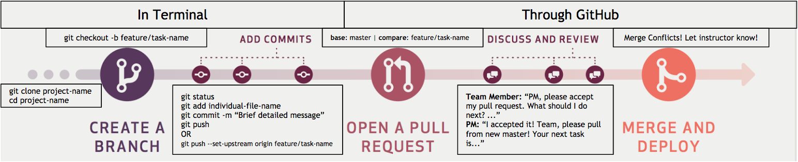

# Final Project Structure
Assignments and Grading for the 3rd and 4th quarter
- Final project: Minimum of 6 commits a week and Pull request when a task is complete 
- Quizzes: Take home quiz every other week
- Research assignments: Given every other week and turned in as a medium blog. Research assignments will be relevant to each team's project.

## Teams
- All students will get into teams of 3 or 4
- Each teams will select a project manager for their group
- Each team will select a team name
- Project Manager on the team will be responsible for creating the team's repo for their final project using the project [template](https://github.com/junior-devleague/capstone/blob/master/projects/capstone-project-template.md).

## Daily Scrum
- Teams will meet daily for the first 5-10 mins of class to report the following:
  - Progress on their task. What did team members accomplish in the previous class?
  - What each team member is going to work for the current class period
  - Any road blocks per task or clarifications they may need from other team memebers or instructors

## Project Manager reports daily to the instructors the following:
- Progress per task that the group is currently working on
- Projection as to what will be accomplished by the end of the week
- Any road blocks per task or clarifications the team may need

**Developers are to notify the project manager and an instructor (in person or in Slack) when:**
- A task is complete
- A pull request is made

If there are questions about a task, code questions, road blocks (challenges) please notify an instructor via Slack.

## Javascript
  - Function names and variables should be camelcase.
  - Any nesting must be properly tabbed. No one liners for multiple lines of code.
  - Use block comment for each a task.
  - Each Javascript task should have a block comment of psuedo code.

## Text Editor
You may use any of the following text editors:
- Sublime Text
- VS Code
- Atom
- Make sure you watch your syntax
- Set spaces: 2

## Git Flow

Github Commit Messages: 
- What was completed, any current bugs. 
- Example: ‘completed top navigation in html, links do not work yet’

## Task Tracking
- Each task should be tracked in GH project within the project repo
- Create a new project in the team repo
- Create a To-Do, In-Progress, and Done column within the newly created project board
- Use GH Issues to create task lists for team members
- Move the issues to their respective colum in the project board

## Stretch Goals
- Stretch goals should only be completed if development on MVP is completed. However, teams must stop development at development deadline, regardless if they finish stretch goals or not.
